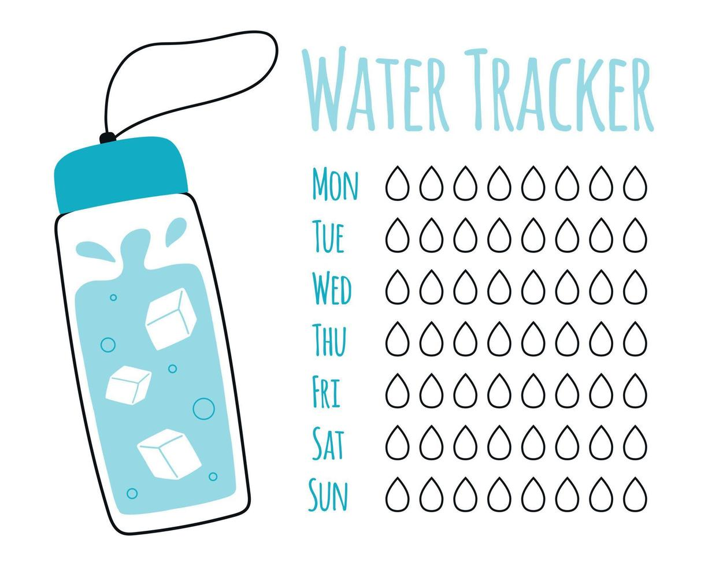

# Water Tracker

Water Tracker - це застосунок для моніторінга споживаної води. Розроблений для легкого відстеження
кількості випитої води та встановлення особистих цілей для підтримки здоров'я. Water Tracker має
зручний та адаптивний інтерфейс, який спрощує відслідковування кількості випитої води без зайвих
зусиль.

## Основні можливості користувача:

- **Налаштування профілю:** додавання або зміна особистих даних та фотографії.
- **Обчислення денної норми вживання води:** за допомогою вбудованої формули або встановлення
  власної норми.
- **Редагування денної норми вживання води.**
- **Додавання, редагування та видалення кількості випитої води за день.**
- **Відстеження прогресу за графіком відсотків випитої води за день та місяць.**

## Використані технології:

### Front-End:

- React
- Redux
- Axios
- HTML/CSS
- Formik

### Back-End:

- Node.js
- Express
- MongoDB
- Mongoose
- Swagger
- Joi
- Nodemailer

### Інші інструменти:

- Google OAuth

## Встановлення та налаштування проекту:

1. **Встановлення залежностей:** Виконайте команду `npm install` для встановлення всіх необхідних
   залежностей.
2. **Клонування репозиторію:** Склонуйте репозиторій з проектом на ваш комп'ютер.
3. **Встановлення залежностей проекту:** Виконайте команду `npm install` у кореневій директорії
   проекту.
4. **Налаштування середовища:** Створіть файл `.env` в кореневій директорії проекту та заповніть
   його необхідними змінними середовища (див. `.env.example`).
5. **Запуск проекту:** Після встановлення залежностей та налаштування середовища, запустіть проект
   за допомогою команди `npm run dev`.

## Розробники:

### Front-End and Back-End:

- **Данило** ([GitHub](https://github.com/DanilTop3245)): Розробник усього додатку.
